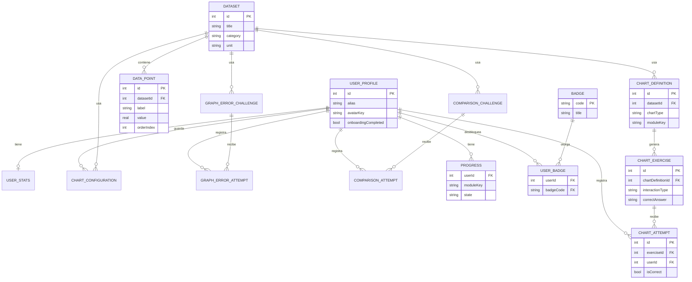

# Base de datos — Gráficos Divertidos

Motor: **SQLite** vía **Room 2.6.1**. Base de datos única `graficos_divertidos.db`, local al dispositivo, sin sincronización remota. El esquema SQL completo está en `database/schema.sql`; una muestra de datos en `database/sample_data.sql`.

## 1. Tablas, campos y restricciones

### `user_profile`
| Campo | Tipo | Notas |
|---|---|---|
| id | INTEGER | PK autogenerada |
| alias | TEXT | máx. 16 caracteres (validado en UI), nunca nombre real |
| avatarKey | TEXT | una de 8 claves de avatar local |
| createdAt / lastOpenedAt | INTEGER | epoch millis |
| soundEnabled / hapticsEnabled | INTEGER (bool) | preferencias, por defecto activadas |
| onboardingCompleted | INTEGER (bool) | controla si se muestra el onboarding |

### `user_stats`
PK `userId` → FK a `user_profile.id` (CASCADE). Guarda `totalXp`, `totalStars`, `currentStreak`, `bestStreak`, `exercisesCompleted`, `updatedAt`. Es la vista agregada que alimenta Home/Galería; se recalcula por completo en cada transacción de `ProgressRepository`.

### `dataset` / `data_point`
`dataset`: catálogo de 30 conjuntos de datos semilla (`title`, `category`, `unit`, `iconKey`, `isSeed`). `data_point`: 1-N con `dataset` (`datasetId` FK CASCADE, índice), cada fila es una categoría con su `value` (REAL) y `orderIndex`.

### `chart_definition`
Un gráfico "de referencia" listo para mostrarse: `datasetId` (FK CASCADE), `chartType` (BARRAS/PICTOGRAMA/LINEAS/CIRCULAR), `title`, `showLabels`, `showLegend`, `axisMax` (nullable), `moduleKey`. Se reutiliza entre varios `chart_exercise` cuando aplica.

### `chart_exercise`
`chartDefinitionId` (FK CASCADE), `moduleKey`, `interactionType` (SELECCION_EN_GRAFICO / ORDENAR_CATEGORIAS / ESTIMAR_VALOR / COMPARAR_PUNTOS / OPCION_MULTIPLE), `prompt`, `correctAnswer` (lista de enteros codificada), `options` (lista de texto codificada), `explanationCorrect`, `explanationIncorrect`, `difficulty`.

### `chart_attempt`
Historial de intentos: `exerciseId` + `userId` (FK CASCADE ambos, índices), `selectedAnswer`, `isCorrect`, `firstTry`, `attemptAt`, `xpAwarded`. Nunca se actualiza ni se borra un intento pasado: el progreso se **deriva** de este historial mediante consultas agregadas, nunca al revés.

### `chart_configuration`
Gráficos guardados por el usuario en el Constructor: `userId` + `datasetId` (FK CASCADE), `chartType`, `title`, `categoryOrder`, `showLabels`, `showLegend`, `axisMax`, `createdAt`.

### `graph_error_challenge` / `graph_error_attempt`
Catálogo de 30 gráficos deliberadamente problemáticos (`errorType` es uno de los 6 tipos: EJE_TRUNCADO, ESCALA_INCONSISTENTE, DATOS_FALTANTES, TITULO_ENGANOSO, CATEGORIA_INCORRECTA, PICTOGRAMA_SIN_ESCALA) con campos opcionales según el tipo de error (`axisMinOverride`, `unitPerIconOverride`, `omittedCategoryLabel`). `graph_error_attempt` registra cada intento del usuario, igual que `chart_attempt`.

> **Nota de diseño:** la especificación menciona una entidad "GraphError" junto a "GraphErrorChallenge". Como el catálogo de tipos de error es un conjunto cerrado y pequeño (6 valores fijos), se modeló como el enum `GraphErrorType` (convertido a TEXT por Room) en lugar de como tabla independiente — evita una tabla de catálogo trivial sin más atributos que un nombre, sin perder expresividad ni capacidad de consulta.

### `comparison_challenge` / `comparison_attempt`
20 retos de comparación: `datasetId` (FK CASCADE), `chartTypeA`/`chartTypeB`, `question`, `betterSide` ('A'/'B'), `explanation`, `difficulty`. `comparison_attempt` registra los intentos.

### `progress`
PK compuesta `(userId, moduleKey)`, FK CASCADE a `user_profile`. `completedCount`, `totalCount`, `correctCount`, `attemptsCount`, `state` (BLOQUEADO/DISPONIBLE/INICIADO/COMPLETADO/DOMINADO), `updatedAt`. Una fila por módulo y usuario.

### `badge` / `user_badge`
`badge`: catálogo fijo de 10 insignias (PK `code`). `user_badge`: PK compuesta `(userId, badgeCode)`, FK CASCADE a ambas tablas; se inserta solo cuando `GamificationEngine.evaluateNewlyEarnedBadges` determina que corresponde, dentro de la misma transacción que registró el intento que la desbloqueó.

## 2. Índices

Se indexan todas las columnas FK usadas en joins frecuentes: `data_point.datasetId`, `chart_definition.datasetId`/`moduleKey`, `chart_exercise.chartDefinitionId`/`moduleKey`, `chart_attempt.exerciseId`/`userId`, `chart_configuration.datasetId`/`userId`, `graph_error_challenge.datasetId`, `graph_error_attempt.challengeId`/`userId`, `comparison_challenge.datasetId`, `comparison_attempt.challengeId`/`userId`, `progress.userId`, `user_badge.userId`/`badgeCode`.

## 3. Relaciones y restricciones

Todas las relaciones son 1-N con `ON DELETE CASCADE`: borrar un `dataset` elimina sus `data_point`, `chart_definition`, `graph_error_challenge` y `comparison_challenge` asociados (y en cascada, sus ejercicios/intentos). Borrar un `user_profile` elimina todo su historial (`user_stats`, `chart_attempt`, `graph_error_attempt`, `comparison_attempt`, `chart_configuration`, `progress`, `user_badge`) — es lo que ocurre, por diseño, al desinstalar la app.

## 4. Consultas importantes

- Progreso de un módulo: `COUNT(DISTINCT exerciseId)` de intentos correctos vs. total de `chart_exercise` de ese `moduleKey`.
- Cola de repaso (Desafíos): ejercicios cuyo `id` no aparece en ningún `chart_attempt` correcto del usuario, para los 4 módulos base.
- Racha: se recalcula recorriendo `chart_attempt.isCorrect` ordenado por `attemptAt` para el usuario.
- Insignias pendientes: `badge.code NOT IN (SELECT badgeCode FROM user_badge WHERE userId = ?)`.

## 5. Datos semilla

30 datasets / 45 definiciones de gráfico / 50 ejercicios / 30 retos del Detective / 20 retos del Comparador / 10 insignias, generados por `tools/generate_seed_content.py` hacia `SeedContent.kt` e insertados por `DatabaseSeeder.seedIfNeeded()` la primera vez que se abre la app (operación idempotente: si ya hay datasets, no se repite).

## 6. Diagrama entidad-relación (Mermaid)

